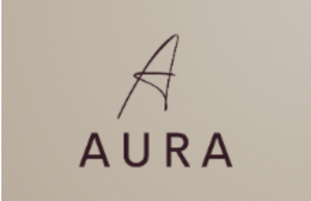
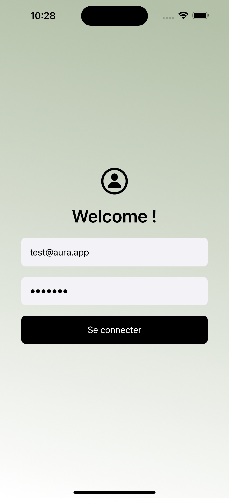
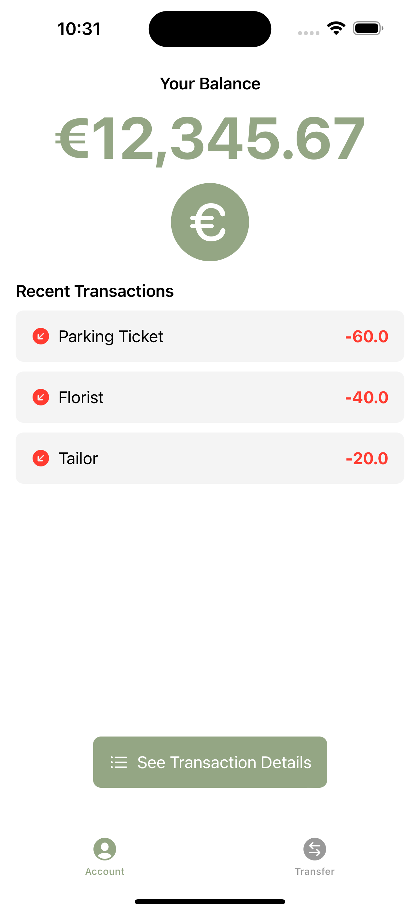
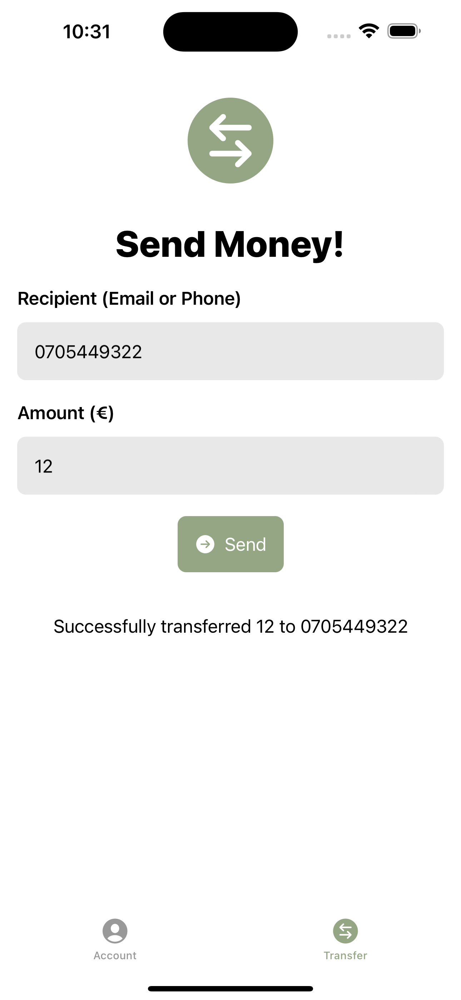

<div align="center">

</div>

# iOS Banking Application

This project involves developing a banking application for iOS using the MVVM architecture. The goal is to create an application that allows users to manage their bank account, display recent transactions, make transfers, and access other essential features.

## Features

The iOS banking application will offer the following features:

User Authentication: Users will need to authenticate to access their bank account.
Account Information Display: Users will be able to view their account balance and recent transactions.
Complete Transaction History: Users will have access to their full transaction history.
Money Transfer: Users will be able to transfer money to other accounts.

## Technologies Used

The project will be developed using the following technologies:

- **Swift**: The primary programming language for iOS development.
- **UIKit**: A framework for building user interfaces.
- **MVVM (Model-View-ViewModel)**: The architecture used to structure the application and separate concerns.
- **API**: An external API will be used to fetch and send real-time data.
- **Unit Testing**: Unit tests will be implemented to ensure sufficient code coverage and reliability.

## Prerequisites

Before running this project, ensure that the following are installed:

- **Xcode**: The integrated development environment (IDE) for iOS development.
- **Apple Developer Account**: You will need an Apple Developer account to build and run iOS applications on a real device.

## Installation and Execution

1. Clone this repository to your local machine.
   
   ```bash
   git clone [repository-url]
   ```

2. Open the project in Xcode.

   ```bash
   open ProjectName.xcodeproj
   ```

3. Build and run the application on the iOS simulator or a real device by selecting the appropriate target in Xcode and clicking the **Run** button.

## Screenshots

| <p align="center"></p> | <p align="center"></p> | <p align="center"></p> |
|:--:|:--:|:--:|
| **Connexion** | **Account** | **Transfer** |

- **Screenshot 1**: Display the user authentication screen where users can log in with their credentials.
  
- **Screenshot 2**: Show the main dashboard, including account balance and recent transactions, once the user has logged in.

- **Screenshot 3**: Present the money transfer screen, where users can input transfer details such as the recipient's account information, amount, and any necessary confirmation actions.

These can help illustrate the user flow and functionality visually.


## Demo Video

<div align="center">

</div>


## Contribution

Contributions to this project are welcome! If you'd like to contribute:

1. Create a new branch from the main branch.

## License

This project is licensed under the MIT License. You can refer to the LICENSE file for more details on the terms and conditions of the license.
   ```bash
   git checkout -b your-feature-branch
   ```

2. Make your changes and commit them.

3. Open a pull request to the main branch once you're finished.

   This will allow for code review and discussion before merging your changes.
