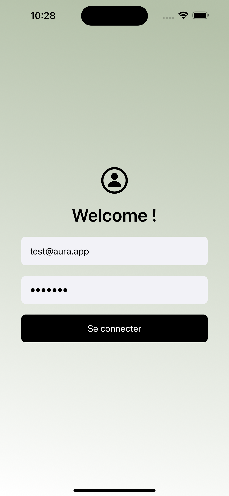
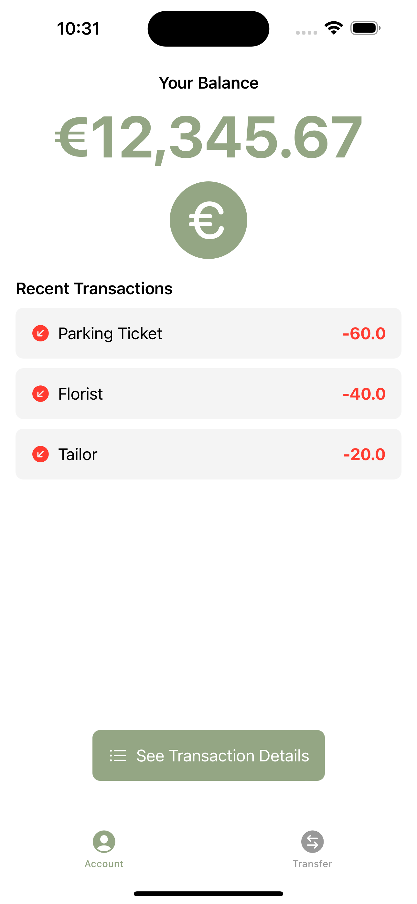
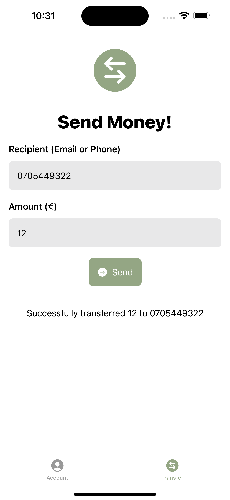

<div align="center">

</div>

# Application Bancaire iOS

Ce projet consiste à développer une application bancaire pour iOS en utilisant l’architecture **MVVM**.  
L’objectif est de créer une application permettant aux utilisateurs de gérer leur compte bancaire, afficher les transactions récentes, effectuer des virements et accéder à d’autres fonctionnalités essentielles.

## Fonctionnalités

L’application bancaire iOS offrira les fonctionnalités suivantes :

- **Authentification utilisateur** : Les utilisateurs devront s’authentifier pour accéder à leur compte bancaire.  
- **Affichage des informations du compte** : Les utilisateurs pourront consulter leur solde et leurs transactions récentes.  
- **Historique complet des transactions** : Les utilisateurs auront accès à l’historique complet de leurs transactions.  
- **Virement d’argent** : Les utilisateurs pourront transférer de l’argent vers d’autres comptes.

## Technologies utilisées

Le projet sera développé avec les technologies suivantes :

- **Swift** : Langage de programmation principal pour le développement iOS.  
- **UIKit** : Framework pour créer des interfaces utilisateur.  
- **MVVM (Model-View-ViewModel)** : Architecture utilisée pour structurer l’application et séparer les responsabilités.  
- **API** : Une API externe sera utilisée pour récupérer et envoyer des données en temps réel.  
- **Tests unitaires** : Des tests unitaires seront mis en place pour assurer la fiabilité et une couverture suffisante du code.

## Prérequis

Avant d’exécuter ce projet, assurez-vous que les éléments suivants sont installés :

- **Xcode** : L’environnement de développement intégré (IDE) pour iOS.  
- **Compte Apple Developer** : Vous aurez besoin d’un compte Apple Developer pour exécuter l’application sur un appareil réel.

## Installation et exécution

1. Clonez ce dépôt sur votre machine locale :
   
   ```bash
   git clone [repository-url]
   ```

2. Ouvrez le projet dans **Xcode**.


   ```bash
   open ProjectName.xcodeproj
   ```

3. Compilez et lancez l’application dans le **simulateur iOS** ou sur un appareil réel en sélectionnant la cible appropriée dans Xcode et en cliquant sur le bouton **Run**.

## Screenshots

| <p align="center"></p> | <p align="center"></p> | <p align="center"></p> |
|:--:|:--:|:--:|
| **Connexion** | **Account** | **Transfer** |

- **Capture 1** : Affiche l’écran d’authentification où l’utilisateur peut se connecter avec ses identifiants.

- **Capture 2** : Montre le tableau de bord principal, incluant le solde du compte et les transactions récentes après connexion.

- **Capture 3** : Présente l’écran de virement, où l’utilisateur peut saisir les détails du transfert, tels que les informations du compte destinataire,

## Vidéo Démo

<div align="center">

</div>


## Contribution

Les contributions à ce projet sont les bienvenues ! Si vous souhaitez contribuer :

1. Créez une nouvelle branche à partir de la branche principale.

## Licence


Ce projet est sous licence **MIT**. Vous pouvez consulter le fichier LICENSE pour plus de détails sur les termes et conditions de la licence.
   ```bash
   git checkout -b your-feature-branch
   ```

2. Apportez vos modifications et effectuez un commit.

3. Ouvrez une **pull request** vers la branche principale une fois vos modifications terminées.

   Cela permettra une revue de code et des discussions avant la fusion de vos changements.
